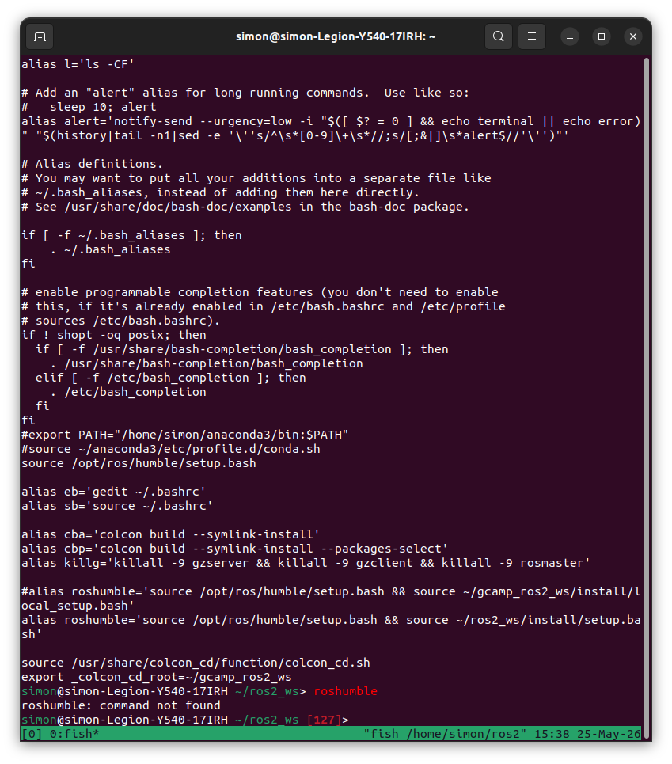

# RoboCmd - control your robot motion



This program is wirted by c++ and you can move your robot motion.

requirement :
- c++ compiler that support c++11 or later
- A posix-compliant system linux ro macOS

### Install Dependencies :
Open a terminal and run :
```bash
$ sudo apt update
$ sudo apt install g++
```
### Use this repository

Clone the repo :
```bash
$ git clone ...
```
Compile the code :
```bash
$ cd RobotCmd_v2
$ mkdir build && cd build
$ cmake ..
$ make
```
Run the command :
```bash
$ ./robot_cmd_seq
```
## Acknowledgement
this repository for before the ros2 lecture we have to lean simply about git, docker, ros2, code editor etc etc etc
[udemy](http://naver.com) i'm facker.


